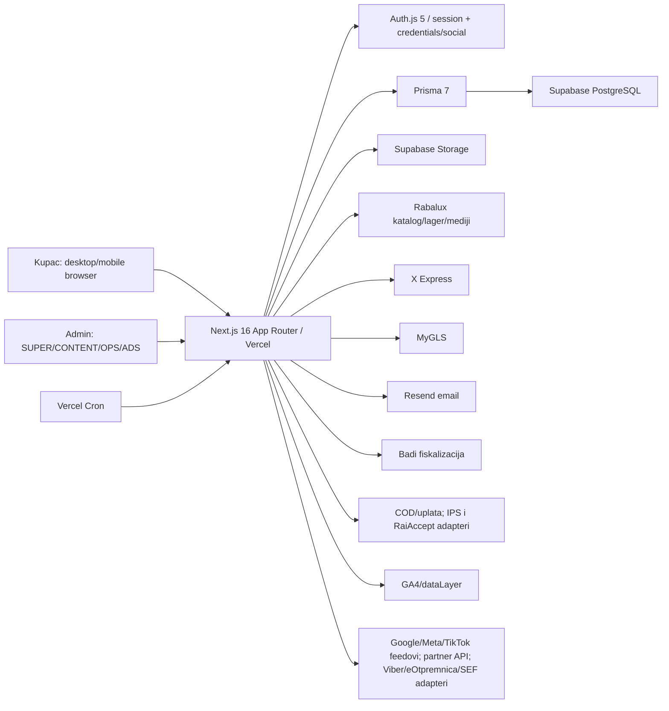

# Mapa sistema

## Arhitektura

## Tehnološki presek

| Sloj | Implementacija |
|---|---|
| Web | Next.js `16.2.11`, React `19.2.4`, App Router, Server/Client Components |
| Auth | Auth.js `5.0.0-beta.32`, customer i admin guard-i, DB sessionVersion/enabled provere |
| Podaci | Prisma `7.9`, PostgreSQL/Supabase, približno 100 modela |
| Storage | Supabase; `product-media` public, PII/operativni bucket-i private |
| Test | Vitest `4.1.10`, Playwright `1.61.1` |
| Hosting/cron | Vercel; 11 cron schedule-a |
| Integracije | Rabalux, X Express, MyGLS, Resend, Badi, IPS, RaiAccept, GA4; adapteri za Viber/eOtpremnica/SEF/feedove/partner API |

## Površina aplikacije

| Površina | Broj iz statičkog inventara |
|---|---:|
| Page rute | 101 |
| Javni/customer page segment | 47 |
| Admin page segment | 54 |
| API route fajlovi | 86 |
| Izvezene API metode | 113 |
| Statičke JSX kontrole/form definicije | 1.567 |
| Ukupno inventarisano | 1.780 |

Tačne rute i kontrole su u `02_FUNCTIONAL_INVENTORY.csv`. JSX broj je broj statičkih definicija; mapirane runtime instance mogu biti brojnije.

## Glavni poslovni tokovi

### Storefront i porudžbina

1. Katalog/listing/search čitaju publikovane proizvode i cene.
2. Web availability kombinuje DC i dobavljačko stanje; Rabalux stanje važi 30 minuta, umanjuje rezervacije i safety buffer od jedne jedinice.
3. Cart state se čuva klijentski i server potvrđuje proizvode/cene pri checkout-u.
4. Checkout čuva session state, obračunava stavke, popuste, dostavu i opcionalnu montažu.
5. Finalni submit u transakciji kreira porudžbinu/stavke/payment podatke i pokreće rezervacije/background poslove.
6. Dalji tokovi uključuju email, payment callback ili COD, shipment, pickup/dispatch, fiskalizaciju i status obaveštenja.

### Admin/ERP

- Role: `SUPER`, `CONTENT`, `OPS`, `ADS`; `SUPER` je globalno ovlašćen, ostali koriste allow-list guard-e.
- Content/CMS: kategorije, landing, banneri, media, proizvodi, SEO/marketing sadržaj.
- ERP: artikli, dobavljači, nabavne cene, narudžbenice, ulazni računi, prodajne porudžbine, cenovnici/akcije, magacini, prijemi/otpremnice, popisi, transferi, pickup batch-evi, izveštaji.
- Operations: porudžbine, reklamacije, kuriri, fiskalni dokumenti, integracije i background poslovi.
- Marketing/analytics: newsletter, audience/campaign tok, GA4 i poslovne metrike.

## Ključni modeli podataka

| Domen | Reprezentativni modeli |
|---|---|
| Identity | `User`, Auth.js account/session/token, `AdminUser`, role/permission guard, `AuditLog` |
| Catalog | `Product`, category/collection/brand/media/attribute/price/promotion strukture |
| Commerce | `Cart/CheckoutSession`, `Order`, `OrderItem`, `Payment`, `Refund` |
| Fulfilment | `Shipment`, warehouse/stock/reservation/movement, pickup/dispatch modeli |
| ERP | supplier, supplier import/snapshot, purchase order, inbound invoice, invoice, fiscal document |
| Communication | email log, newsletter contact/audience/campaign, Viber/alert/background job |
| Integration | provider health, courier sync/webhook, supplier import, partner API i cron evidencija |

## Cron mapa

| Učestalost | Endpoint | Svrha |
|---|---|---|
| 5 min | `/api/cron/background-jobs` | opšti job worker |
| 5 min | `/api/cron/x-express/webhook-events` | obrada X Express webhook-a |
| 15 min | `/api/cron/fiscal-retry` | fiskalni retry |
| 15 min | `/api/cron/payment-expiry` | istek payment-a |
| 15 min | `/api/cron/rabalux/stock` | Rabalux lager |
| 30 min | `/api/cron/mygls/status-sync` | MyGLS status |
| 30 min | `/api/cron/x-express/status-sync` | X Express status |
| na sat | `/api/cron/email-alerts` | email/alert dispatcher |
| 04:00 dnevno | `/api/cron/mygls/master-data` | MyGLS šifarnici |
| 02:17 dnevno | `/api/cron/rabalux/catalog` | Rabalux katalog |
| ponedeljak 04:30 | `/api/cron/x-express/dictionaries` | X Express šifarnici |

## Trust i safety granice

- Browser input nikada nije autoritet za cenu, lager, permission ili provider status; server ih rekonstruiše/proverava.
- Admin server actions/handlers rade DB enabled i role allow-list provere; UI skrivanje nije jedina zaštita.
- Cron/provider production pozivi su zaključani tajnama i acceptance flag-ovima; auto-create kurirskih pošiljki je lokalno auditovano kao `false`.
- RLS je uključen na public tabelama, a `anon`/`authenticated` nemaju grantove; aplikacija koristi Prisma postgres konekciju.
- `fiscal-receipts`, `order-receipts`, `reclamation-uploads`, `shipment-labels` su privatni; reklamacije koriste signed URL, receipt PDF se obrađuje server-side.

## Repozitorijum i deploy trag

- Repo: `markotaskovicspc/Svet-Povoljnih-Cena`, public.
- Auditovani HEAD je identičan `origin/main`; GitHub kombinovani status ima uspešan Vercel check.
- Nema aktivnog GitHub Actions workflow run-a za auditovani commit i nema otvorenih issue/PR stavki koje bi služile kao launch gate.
- Production `/api/health` ne izlaže commit SHA, zato tačan deploy SHA nije nezavisno potvrđen samim runtime endpointom.
