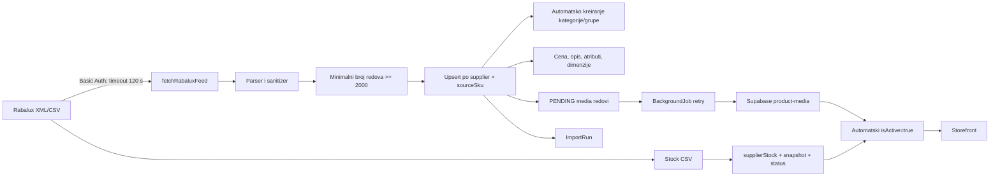

# Rabalux integracija — QA, bezbednosni i release audit

Datum provere: 2026-07-21 (Europe/Belgrade)  
Projekat: `svet-povoljnih-cena`  
Git repozitorijum: `/Users/luka/svet povoljnih cena`  
Folder iz korisničkog zahteva: `/Users/luka/svet povoljnih cena/svet akcija` (nije koren aplikacije)  
Lokalni sajt/API/admin: očekivano `http://127.0.0.1:3000`, `/api`, `/admin`  
Live sajt/API/admin: `https://www.svetpovoljnihcena.rs`, `/api`, `/admin`  
Commit: lokalni `main`; tačan Vercel commit nije potvrđen bez admin pristupa.

## 1. Executive summary

**Odluka: NO-GO za formalno produkciono odobrenje i dalje širenje automatizacije.** Integracija je već aktivna na live-u i osnovni katalog/stock tok radi, ali ne zadovoljava obavezne GO kriterijume. Najveći rizik je da jedan dovoljno veliki, ali nepotpun katalog odmah deaktivira sve izostavljene proizvode. Ne postoji batch rollback, globalni sync lock, stvarni diff preview, approval status za nove proizvode ni pouzdana zaštita ručnih izmena. Lokalno okruženje koristi udaljeni Supabase i live base URL, dok destruktivni integracioni test briše sve background jobove i email zapise; zato nije pokrenut.

Rezultati audit testova: **11 PASS, 5 FAIL, 8 BLOCKED, 20 NOT RUN**.  
Problemi: **2 Critical, 9 High, 5 Medium, 1 Low**.

Najvažniji potvrđeni produkcioni podaci (read-only DB, 2026-07-21 16:06–16:08 CEST):

- Dobavljač `supplier-rabalux` postoji i `enabled=true`.
- 2.897 Rabalux proizvoda: 2.892 aktivna, 5 neaktivnih, 0 bez external ID-ja, 0 bez kategorije, 0 bez READY slike, 5 sa cenom `<= 0`.
- Poslednji catalog run `cmru0wvgd002904jjaf25vioy`: SUCCESS, 2.897/2.897, 0 fail, 188 s, XML, 6 invalid, 0 disappeared.
- Stock cron stvarno radi na 15 minuta; poslednji provereni run je 2.893/2.893 SUCCESS.
- Jedan stock run `cmrumtgtp000f04jszigabumu` ostao je `RUNNING` od 12:30 UTC iako su kasniji run-ovi uspešni.
- Rabalux media queue: 23.539 COMPLETED, 119 RETRY, 2 RUNNING, 0 FAILED. Najstariji RETRY je na pokušaju 10/12 i dobija Supabase `413 Maximum size exceeded`.
- Ne postoji nijedan `ImportRun(kind=MEDIA)` i nema `rabalux.*` admin audit zapisa.
- Nijedan od 2.897 proizvoda nema `syncOverrides`; ručne vrednosti nisu zaključane.

## 2. Opseg, ograničenja i dokazi

Dozvoljene live akcije tokom audita: read-only baza, javni storefront, neautentifikovan admin pristup, neautentifikovan cron poziv.  
Namerno nisu rađeni: live sync, live preview koji upisuje `ImportRun`, login, kreiranje proizvoda/narudžbine, promena cene/stanja, load test i bilo kakvo brisanje.

Dokazi:

- Kod: `src/lib/rabalux/*`, `src/app/api/cron/rabalux/*`, `src/app/admin/xml-import/page.tsx`, Prisma šema/migracija, Vercel cron i testovi.
- Baza: agregatni read-only Prisma upiti, bez čitanja kupaca, narudžbina ili tajni.
- Live UI: početna, PDP `/p/menazi-72022`, neaktivan `/p/700-700`, `/admin/xml-import` bez sesije.
- Live API: `GET /api/cron/rabalux/catalog` bez Authorization zaglavlja → HTTP 401 `{"error":"unauthorized"}`.
- Test komande navedene u odeljku 12.

Blokade:

- Nema izolovane lokalne/test baze; `.env.local` pokazuje udaljeni Supabase na portu 5432 i `NEXT_PUBLIC_BASE_URL` pokazuje live domen.
- Nema test naloga za CONTENT/OPS/SUPER niti MFA podataka.
- Rabalux kredencijali nisu lokalno podešeni; nisu ni traženi ni prikazani.
- Nema Rabalux ugovorne/tehničke dokumentacije, rate limita, SLA-a, definicije statusa i poslovnog pravila za cene/odobravanje.
- Nema pristupa Vercel logovima/monitoringu niti deployed commit SHA-u.

## 3. Stvarna arhitektura i izvor podataka

### Potvrđena arhitektura

- Katalog: primarni XML feed `https://rabalux.rs/downloadmanager/downloadha/nohtml/1/id/332`.
- Fallback kataloga: srpski CSV `https://rabalux.hu/downloadmanager/downloadha/nohtml/1/id/18`.
- Lager: CSV `https://rabalux.hu/downloadmanager/downloadha/nohtml/1/id/11`.
- Autentifikacija: HTTP Basic Auth; DB čuva samo `env:RABALUX_*` reference, a vrednosti dolaze iz server env-a.
- Cron: katalog svaki dan u 02:17 UTC; stock na 15 minuta (`vercel.json:37-42`).
- Queue/worker: DB `BackgroundJob`, obrađuje se svakih 5 minuta; koristi se za media i druge post-commit poslove.
- Webhook: ne postoji.
- Full sync: katalog i stock su uvek kompletni feedovi.
- Incremental sync/cursor/updated_at/paginacija: ne postoje.
- Ručno pokretanje: OPS/SUPER kroz `/admin/xml-import`, uz live preview token, frazu i razlog.
- Single-product sync, selected-products sync, retry samo grešaka, cancel, rollback: ne postoje.
- Import istorija: `ImportRun`; nema per-product last-sync/batch relacije.
- Identitet: `Product.supplierId + supplierExternalId` je unique; `supplierExternalId` je Rabalux `Sku`; javni SKU je `RAB-<Sku>`.
- Slike/PDF/video: dozvoljen je samo host `rabaluxkep.plugin.hu/images/*`, sadržaj se kopira u javni Supabase `product-media`; slike dobijaju thumb/card/PDP WebP varijante.

### Tok i tačke otkaza

Greške po tačkama:

| Tačka | Trenutna zaštita | Preostali problem |
|---|---|---|
| Feed/auth | 120 s timeout, HTTP status provera, XML→CSV fallback | Nema retry/backoff/rate-limit logike; stock nema fallback. |
| Potpunost | Fiksni minimum 2.000 redova | Feed od 2.001 umesto 2.897 prolazi i može masovno deaktivirati/oboriti stock. |
| Parser | Cena/kategorija/type validacija; sourceSku/name bez kojih se red odbacuje | Odbacivanje nije per-row greška; može izgledati kao nestanak postojećeg proizvoda. |
| Identitet | Unique `(supplierId, supplierExternalId)` i globalno unique SKU | Nema SKU/EAN conflict workflow; promenjen external ID pravi novi proizvod. |
| Kategorije | Advisory lock i collision-safe slug | Nema poslovnog mappinga/odobrenja; nova kategorija se automatski kreira. |
| Upsert | Transakcija po proizvodu, Promise.allSettled | Nema batch transakcije, resume tačke ni globalnog sync locka. |
| Nestanak | Hard delete se ne koristi | Jedan feed odmah postavlja `isActive=false`; stock odsustvo odmah postavlja 0. |
| Media | Host allowlist, redirect error, MIME/veličina/dimenzije, retry | URL se prisilno vraća na HTTP; 119 RETRY; storage limit nije usklađen sa app limitom. |
| Objavljivanje | Cena > 0, kategorija, READY slika, status nije ARH | Automatsko objavljivanje; nema pending approval ni obaveznih atributa/opisa. |
| Audit | ImportRun zbirni brojevi; admin action audit | Nema stare/nove vrednosti po polju, product/batch veze, correlation ID-ja ili rollbacka. |

## 4. Šta se stvarno dešava kada Rabalux doda proizvod

1. Dnevni catalog cron preuzme ceo XML; pri grešci pokušava ceo CSV fallback.
2. Parser zadržava samo redove sa `Sku` i `Name`.
3. `Sku` postaje `supplierExternalId`; javni SKU postaje `RAB-<Sku>`.
4. Sistem traži proizvod isključivo po `(Rabalux supplier, sourceSku)`.
5. Kategorija i tip se automatski kreiraju kao Category hijerarhija; tip se kreira i kao Group.
6. Naziv, EAN, opis, cene, boje, materijali, dimenzije, tehničke specifikacije, garancija i poreklo se upisuju.
7. Novi proizvod dobija local stock 0, supplier stock 0, rok 7–10 dana i `isActive=false`.
8. Slike/dokumenti se kreiraju kao PENDING i media job se upisuje idempotentnim ključem po asset ID-ju.
9. Worker preuzima i kopira assete u Supabase. Posle prve READY slike, pozitivne cene i kategorije proizvod automatski postaje aktivan.
10. Sledeći stock sync upisuje dobavljačko stanje/status i takođe može aktivirati proizvod.
11. Nema administratorskog approval koraka; proizvod može postati vidljiv pre admin pregleda.
12. `ImportRun` čuva zbirne brojeve, ali ne i per-product diff/istoriju.

Live dokaz: DB uzorak `RAB-72022` (Menazi, 19.990 RSD, supplierStock 5, Visilice, 28 tehničkih polja, READY mediji) identično je prikazan na `/p/menazi-72022`, sa aktivnim „Dodaj u korpu“, 7–10 dana, slikama, specifikacijama i PDF uputstvom. DB + sajt = PASS. Neaktivan `RAB-700`, cena 0, vraća not-found. DB + sajt = PASS.

## 5. Matrica vlasništva nad podacima

Legenda: R=Rabalux, L=lokalni admin/ERP, D=derived. „Audit” znači per-field stara/nova vrednost; trenutno je svuda **ne** za sync.

| Polje | Rabalux šalje | Gde se čuva | Auto update | Admin/konflikt/prioritet |
|---|---|---|---|---|
| Rabalux external ID | `Sku` | `supplierExternalId` | pri create; identitet | Nema edit u ovom adminu; R je prioritet; promena se tretira kao novi proizvod. |
| SKU | izvedeno `RAB-<Sku>` | `Product.sku` | da | `identity` lock postoji u JSON-u; nema automatskog locka. |
| EAN/bar-kod | `Ean11` | `barcode` | da | Admin može menjati; čuva se samo ako ručno uključi `identity`; nema duplicate kontrole. |
| Naziv | `Name` | `name` | da | Admin može; `name` lock radi, ali nije automatski postavljen. |
| Brend | nije mapiran | supplier relacija implicira Rabalux | ne | Nema product brand polja/pravila. |
| Serija/kolekcija | nije potvrđeno/mapirano | `collectionId` ostaje lokalni | ne | Lokalno. |
| Kratak opis | izveden iz opisa, 320 znakova | `shortDescription` | da | `description` lock ga štiti. |
| Detaljan opis | `Description`, sanitizovan | `description` | da | Admin može; bez locka se prepisuje. |
| Kategorija/potkategorija | `Product_category` + `Type` | `Category`, `ProductCategory` | da | Auto-kreira; admin promena se prepisuje bez `categories` locka. |
| Varijanta | nije kreirana | `Variant` se ne koristi u syncu | ne | Nedefinisano. |
| Boja | `Lamp_colour`, `Colour_of_lampshade` | `colorPrimary/Secondary` | da | Nema namenski lock; samo sirovo ime polja nije ponuđeno u UI. |
| Materijal | dva feed polja | `Material`, `ProductMaterial` | da | `materials` lock radi; admin media/category edit ga ne postavlja. |
| Dimenzije/težine | više feed polja | decimalna Product polja | da | `dimensions` lock radi ako se ručno uključi. |
| Tip rasvete/grla/izvor/sнага/napon/K/lm/IP/energetska klasa | feed tehnička polja | `technicalSpecs` JSON | da | `specifications` lock postoji u importeru, ali nije ponuđen u admin checkbox listi. |
| Glavna/dodatne slike | image liste | `ProductMedia` | da, kompletna zamena | `media` lock radi; ručna izmena slike ne uključuje lock automatski. |
| PDF dokumentacija | manual/energy PDF | `ProductAttachment` | da, kompletna zamena | Importer podržava `attachments` lock, ali UI ga ne nudi. |
| Nabavna cena | ne | `cogs`/PurchasePrice odvojeno | ne | Lokalni ERP. |
| Prodajna/puna cena | `Recommended_price` | `fullPrice` | da | R prepisuje bez `pricing`; nema threshold/approval. |
| Snižena/preporučena cena | `Recommended_retail_price` ako je >0 i < puna | `salePrice`, `discountPct` | da | R prepisuje bez `pricing`; semantiku mora potvrditi biznis. |
| Valuta | nije u parseru | Supplier je seedovan RSD | ne | Pretpostavka RSD, nije ugovorom potvrđeno. |
| PDV | nije u parseru | nema Rabalux mappinga | ne | Nedefinisano. |
| Lokalno stanje | ne | `stock`/WarehouseStock | ne od Rabaluxa | Lokalni ERP; catalog sync ga ne menja. |
| Dobavljačko stanje | CSV kolona 6 | `supplierStock` + snapshot | da, 15 min | Stock sync ignoriše `syncOverrides`; `stock` checkbox ne štiti ovu vrednost. |
| Rezervisano dobavljačko stanje | ne | `supplierReservedStock` | lokalno | Lokalna checkout alokacija je prioritet i feed je ne briše. |
| Rok isporuke | datum narednog dolaska + hardcoded 7–10 | `supplierNextArrivalAt`, delivery days | da/delom D | `delivery` lock štiti 7–10 od catalog synca. |
| Dostupnost | tekst statusa | `articleStatus`, `isDtz`, `isActive` | da | `restricted→ARH`, `outgoing→DTZ`, ostalo `SP`; `flags` lock je neefikasan. |
| Status objave | ne | `isActive` | automatski D | Admin može menjati, ali media/stock može ponovo promeniti; nema approval workflow. |
| Datum kreiranja | ne | `createdAt` | DB | Lokalni. |
| Rabalux updated_at | nije prisutan | ne čuva se | ne | Incremental sync nije moguć sa trenutnim ugovorom. |
| Poslednja sinhronizacija | ne | samo `ImportRun` batch | da | Nema per-product `lastSyncedAt`. |

**Rizik pregazivanja je potvrđen:** `updateProduct`, promena kategorije i promena medija ne postavljaju `syncOverrides`; trenutno je overrideCount=0. Dodatno, ponuđeni lockovi `stock` i `flags` ne odgovaraju stvarnom stock/status update kodu, dok `specifications` i `attachments` nisu ponuđeni u UI.

## 6. Novi/izmenjeni/nestali proizvodi

### Novi

- Bez opisa: može biti validan i objavljen čim ima cenu/kategoriju/sliku.
- Bez kategorije/type: označen invalid i ostaje neaktivan.
- Nepoznata kategorija: ne ide na mapping; automatski se kreira i može biti objavljena.
- Bez slike ili sa odbijenim URL-om: nije parser greška, ali ostaje neaktivan jer nema READY slike.
- Cena 0/negativna/nedostajuća: `fullPrice=0`, invalid, neaktivan.
- Bez external ID-ja ili naziva: red se potpuno odbaci i nema per-row greške.
- Bez SKU-a: isto kao bez external ID-ja, jer su isto feed polje.
- Bez EAN-a: dozvoljeno.
- Existing SKU/EAN konflikt: nema preflight conflict review; DB unique SKU može dati per-item fail, EAN nije unique.
- Existing external ID: update; composite unique sprečava drugi red.
- HTML/specijalni karakteri: opis se sanitizuje regex pravilima; unit PASS za script/iframe/event attr.
- Dugačak naziv: slug se skrati; samo ime nema parser limit pre DB/admin pravila.
- Više proizvoda: obrađuju se u grupama po 6.
- Veliki katalog: live 2.897 završen za 188 s.
- Prekid/dvostruki/istovremeni sync: nema globalnog locka/checkpointa; FAIL/BLOCKED.

### Izmene

- Sync ponovo upisuje skoro sva Rabalux polja; stock je odvojen.
- Cena, naziv, opis, kategorija, grupa, materijali, specifikacije i mediji mogu biti prepisani.
- Media lista se hard zameni kada se promeni source URL/redosled; stari storage objekti se ne brišu ovde.
- Nema source `updated_at`; stariji feed može prepisati noviji podatak.
- Nema event ordering modela.
- Nema old/new istorije ni rollbacka.
- Cache se revalidira kod admin izmena, ali sync kod ne zove `revalidatePath`; dinamički DB čitaoci uglavnom vide promenu, dok se ponašanje svakog cache sloja nije dokazalo.

### Nestanak

- Catalog: svaki lokalni Rabalux proizvod koji nije u `seen` odmah dobija `isActive=false` (`sync.ts:209-216`). Nema grace perioda, dva uzastopna feeda, preview-a ili masovne potvrde.
- Stock: svaki catalog proizvod koji nije u stock CSV-u odmah dobija `supplierStock=0` i null arrival.
- Fiksni minimum 2.000 nije dovoljan za live bazu od 2.897.
- Nema hard delete-a, što je dobro.
- Vraćanje nije pouzdano samo katalogom; stock sync može reaktivirati spreman proizvod, pa dva feeda mogu međusobno poništavati status.

## 7. Cene i stanje

Potvrđeno:

- Rabalux je trenutni izvor pune i snižene prodajne cene, bez approvala.
- Nabavna cena, lokalni warehouse stock i rezervacije nisu iz Rabalux feeda.
- Supplier stock se osvežava punim CSV feedom na 15 min.
- Effective sellable stock koristi `warehouse + max(supplierStock - supplierReservedStock, 0)`; unit testovi PASS.
- Nema price-change procentualnog praga, valute u feed parseru, PDV validacije ili alert-a.
- Pet live proizvoda sa `fullPrice<=0` pravilno je neaktivno.

Preporuka: dok vlasnik poslovnog procesa ne potvrdi semantiku dve feed cene, automatsku promenu cene treba pretvoriti u proposal. Pretpostavljeni prag (zahteva potvrdu): svaka promena >10% ili na 0 ide na ručno odobrenje; masovna promena >1% kataloga blokira batch.

## 8. Admin panel i komande

Uloge u stvarnom modelu su samo SUPER, CONTENT, OPS, ADS. Ne postoje posebne Product admin/Integration admin uloge. SUPER može sve; Rabalux sync je OPS/SUPER. Backend guard proverava aktuelnog admina u DB i `enabled` stanje, pa skriveno dugme nije jedina zaštita.

| Komanda | Postoji | Uloga / ulaz | Potvrda, idempotency, audit, rollback | Test |
|---|---|---|---|---|
| Test connection | ne | — | Preview zapravo fetchuje oba feeda, ali nije izolovan connection test | NOT RUN |
| Enable/disable | delimično | OPS/SUPER, supplier edit server action | Nema posebne fraze/razloga; admin audit; nema split kill switcha | CODE REVIEW |
| Catalog full sync | da | OPS/SUPER server action ili Bearer cron GET/POST | Preview token+fraza+razlog samo admin; nema sync lock/rollback | FAIL risk |
| Stock full sync | da | isto | isto | Produkciono radi, ali stale run |
| Incremental sync | ne | — | nema updated_at/cursor | N/A |
| Dry-run/preview | delimično | OPS/SUPER | Single-use 10 min token; pravi `ImportRun`; nije DB diff | FAIL |
| Media enqueue | da | OPS/SUPER ili cron endpoint | Preview meri sve feed assete, ne pending; queue ključ je idempotentan | PARTIAL |
| Sync one/selected product | ne | — | — | NOT RUN |
| Retry failed products | ne u UI | worker automatski | retry do 12 za media; nema batch retry UI | FAIL |
| Approve/reject | ne | — | novi proizvod se automatski aktivira | FAIL |
| Publish/unpublish | generički `isActive` | CONTENT/OPS | admin audit; sync može ponovo promeniti | PARTIAL |
| Lock/unlock field | da | CONTENT/OPS | eksplicitni checkbox; audit; neki lockovi neefikasni/nedostaju | FAIL |
| Map category/attribute | ne | — | auto-creation | FAIL |
| Archive/restore | nema Rabalux workflow | generički status drugde | bez batch veze | NOT RUN |
| Cancel running sync | ne | — | — | FAIL |
| Roll back batch | ne | — | — | FAIL |

Server actions nemaju javni, stabilni REST endpoint; browser ih poziva kao Next Server Actions. Cron endpointi su `/api/cron/rabalux/catalog|stock|media`, podržavaju GET i POST, zahtevaju Bearer `CRON_SECRET`, nemaju request body, i rezultat je `{ok, summary}` ili generička 500 poruka. GET ima mutacioni efekat i treba ga ukloniti.

## 9. Statusi i objavljivanje

Ne postoji traženi statusni model Detected/Pending import/Pending mapping/Pending approval/Approved/Rejected/Sync error. Postoje:

- `Product.articleStatus`: SP, IT, DTZ, DOB, ARH, UZ.
- `Product.isActive`: storefront vidljivost.
- `ProductAssetSyncStatus`: PENDING, READY, FAILED.
- `ImportStatus`: RUNNING, SUCCESS, PARTIAL, FAILED.

Aktivacija je automatska kada je cena >0, postoji kategorija i READY slika, a status nije ARH. Opis, EAN, obavezni tehnički atributi, konflikt i administratorsko odobrenje nisu deo uslova. Za trenutni proces je bezbednija opcija **admin approval**: novi proizvod u `PENDING_APPROVAL`, pa tek odobrenje menja publish status.

## 10. Bezbednost

PASS:

- Feed kredencijali ostaju server-side; admin ih ne prikazuje za Rabalux.
- Basic auth vrednosti nisu logovane u UI.
- Cron proverava timing-safe Bearer secret; live poziv bez tajne je 401.
- Admin stranica bez sesije preusmerava na login.
- Backend role guard ponovo čita admina i odbija disabled admina.
- Description sanitizer skida aktivne tagove/atribute; unit PASS.
- Media SSRF allowlist zahteva tačan host/path, zabranjuje credentials/port i redirect.
- MIME, veličina i image dimensions/PDF magic se proveravaju.

Rizici:

- Media normalizer prisiljava `http:` čak i kada je izvor HTTPS; integritet slike/PDF-a nije kriptografski zaštićen.
- Regex HTML sanitizer nije zamena za battle-tested allowlist sanitizer; fuzz/DOM-based XSS test nedostaje.
- Nema rate limita/globalnog locka za admin sync; dva admina mogu dobiti različite validne preview tokene.
- Audit ne čuva old/new vrednosti i nema zaštitu/retention dokaz.
- Nema Rabalux-scoped correlation ID-ja kroz cron→ImportRun→Product→media job.
- Supplier feed URL je DB konfiguracija; admin ga za Rabalux ne može menjati, ali nema runtime allowlist hosta za katalog/stock.

## 11. Test slučajevi i rezultati

### Zbir

| Status | Broj | Napomena |
|---|---:|---|
| PASS | 11 | Kod/source, unit, lint, build, DB, dva live proizvoda, admin auth, cron auth, catalog run. |
| FAIL | 5 | Stale stock run, media health, Rabalux audit, env isolation, production env validator. |
| BLOCKED | 8 | Write integration/E2E, role matrix, live admin, full sync, race, recovery, performance. |
| NOT RUN | 20 | Detaljni negativni/chaos slučajevi bez izolovane baze/fixture harness-a. |

### Pokrenute komande

| Komanda | Okruženje | PASS/FAIL/SKIP | Rezultat |
|---|---|---:|---|
| `npm test` | lokalni kod, Node | 74/0/0 | 23 test fajla PASS, 618 ms. |
| `npx vitest run tests/unit/rabalux-*.test.ts` (5 fajlova) | lokalni kod | 20/0/0 | Parser, allocation, fulfillment state, media upload, messages PASS. |
| `npm run lint` | lokalni kod | 1/0/0 | ESLint exit 0. |
| `npm run build` | lokalni kod | 1/0/0 | Next 16.2.9 compile, TypeScript i 75 static pages uspešni. |
| `npm run check:production-env` | lokalni `.env.local` | 0/1/0 | 6 nepovezanih globalnih env grešaka; Rabalux nije proveravan jer lokalno nije enabled. |
| `npm run test:integration:rabalux` | udaljeni DB | 0/0/1 BLOCKED | Nije pokrenut: destruktivni cleanup + nije test DB. |
| `npm run test:e2e:rabalux` | udaljeni DB/live-coupled env | 0/0/1 BLOCKED | Nije pokrenut: kreira/briše admina, proizvod i narudžbinu. |

### Detaljni test zapisi

**TEST ID:** RAB-LIVE-001  
**Naziv:** Aktivni proizvod DB → live PDP  
**Oblast:** katalog/storefront  
**Okruženje:** live, read-only  
**Uloga:** gost  
**Prioritet:** P0  
**Preduslovi:** aktivan Rabalux proizvod sa stockom i READY slikom  
**Testni podaci:** RAB-72022 / Menazi  
**Koraci:** read-only DB select; otvori `/p/menazi-72022`; uporedi identitet, cenu, kategoriju, stock dostupnost, medije i specs  
**Očekivani rezultat:** dve ravni se slažu  
**Stvarni rezultat:** 19.990 RSD, Visilice, aktivna korpa, 7–10 dana, slike, 28 specs i PDF; bez console warning/error  
**Status:** PASS  
**Dokaz:** DB + live sajt  
**API zahtev i odgovor:** javni GET PDP  
**Promena u bazi:** nema  
**Batch ID:** poslednji catalog `cmru0wvgd002904jjaf25vioy`  
**Correlation ID/Log:** nije dostupan  
**Povezani bug:** nema

**TEST ID:** RAB-LIVE-002  
**Naziv:** Nevalidan proizvod nije objavljen  
**Oblast:** validacija/publish  
**Okruženje:** live, read-only  
**Uloga:** gost  
**Prioritet:** P0  
**Preduslovi:** DB proizvod RAB-700, fullPrice 0, isActive false  
**Koraci:** potvrdi DB; otvori `/p/700-700`  
**Očekivani/Stvarni rezultat:** proizvod nije javno dostupan; title „Proizvod nije pronađen“  
**Status:** PASS  
**Dokaz:** DB + live sajt  
**Promena u bazi:** nema  
**Batch/Correlation/Log:** nema per-product veze  
**Povezani bug:** RAB-M-001

**TEST ID:** RAB-SEC-001  
**Naziv:** Neautentifikovan pristup adminu i cron API-ju  
**Oblast:** autorizacija  
**Okruženje:** live, read-only  
**Uloga:** neprijavljen  
**Prioritet:** P0  
**Koraci:** otvori `/admin/xml-import`; GET catalog cron bez Bearer-a  
**Očekivani/Stvarni rezultat:** admin redirect na login; cron HTTP 401 `unauthorized`  
**Status:** PASS  
**Dokaz:** live UI + HTTP response  
**Promena u bazi:** nema  
**Batch/Correlation/Log:** nije primenljivo

**TEST ID:** RAB-INT-001  
**Naziv:** Ponovni import, update i manual override  
**Oblast:** DB integration  
**Okruženje:** zahteva izolovanu test bazu  
**Prioritet:** P0  
**Preduslovi:** disposable DB sa migracijama; mock feed/storage  
**Očekivani rezultat:** jedan proizvod, update samo dozvoljenih polja, rezervacija očuvana  
**Stvarni rezultat:** test postoji (`rabalux.integration.test.ts:203-336`) ali nije bezbedno pokrenut  
**Status:** BLOCKED  
**Dokaz:** lokalni env je remote; cleanup ima globalne deleteMany pozive  
**Šta nedostaje:** zaseban DB URL i test guard koji odbija non-test host/database  
**Povezani bug:** RAB-C-002

**TEST ID:** RAB-OPS-001  
**Naziv:** Paralelni stock sync / stale run recovery  
**Oblast:** concurrency/recovery  
**Okruženje:** live read-only dokaz + code review  
**Prioritet:** P0  
**Očekivani rezultat:** jedan aktivan run ili stale timeout/recovery  
**Stvarni rezultat:** jedan RUNNING run ostao stale dok je 58 kasnijih stock run-ova SUCCESS; nema globalnog locka  
**Status:** FAIL  
**Dokaz:** ImportRun ID `cmrumtgtp000f04jszigabumu` + `sync.ts`  
**Povezani bug:** RAB-H-002

### Obaveznih 20 automatizovanih testova — gap analiza

| # | Slučaj | Stanje |
|---:|---|---|
| 1 | Kreiranje novog proizvoda | Test postoji, BLOCKED za izvršenje. |
| 2 | Ponovni import bez duplikata | Test postoji, BLOCKED. |
| 3 | Izmena postojećeg | Test postoji, BLOCKED. |
| 4 | Ručno zaključano polje | Test postoji za name/pricing, BLOCKED; nedostaju stock/flags/media/category. |
| 5 | Nepoznata kategorija | Nedostaje očekivani pending mapping test; kod auto-kreira. |
| 6 | Bez slike | Nedostaje integration/storefront test. |
| 7 | Nevalidna cena | Unit + live PASS; nedostaju negative/format/currency. |
| 8 | Deaktivacija | Nedostaje siguran grace-period test; trenutni kod je nebezbedan. |
| 9 | Nepotpun feed bez masovne deaktivacije | Nedostaje; trenutni kod bi FAIL. |
| 10 | Prekinut full sync | Nedostaje. |
| 11 | Nastavak incremental synca | N/A, feature ne postoji. |
| 12 | Dupla admin komanda | Single-use token test postoji, BLOCKED; različiti tokeni nisu pokriveni. |
| 13 | Nedozvoljena admin komanda | Generic unit postoji; direktan Rabalux server-action test nedostaje. |
| 14 | Retry neuspešnog proizvoda | Generic job retry delimično pokriven; Rabalux asset 413/404/timeout nedostaje. |
| 15 | Rollback batcha | N/A, feature ne postoji. |
| 16 | Dve paralelne sinhronizacije | Nedostaje; produkcioni stale run potvrđuje rizik. |
| 17 | Rabalux rate limit | Nedostaje; implementacija nema rate-limit handling. |
| 18 | Pogrešan redosled update-a | N/A, nema verzije/updated_at. |
| 19 | Bezbedno eksterno HTML renderovanje | Unit PASS za script/iframe/onclick; dodati fuzz/browser XSS. |
| 20 | SSRF kod slika | Unit PASS za host/path; dodati redirect/DNS/IP/encoded-host integration test. |

## 12. Bugovi

### RAB-C-001

**Naslov:** Nepotpun feed može trenutno masovno deaktivirati katalog  
**Severity/Priority:** Critical / P0  
**Okruženje/commit:** svi; lokalni main 2026-07-21  
**Preduslovi:** parsirano najmanje 2.000 redova, ali manje od stvarnih 2.897  
**Koraci:** vratiti kompletan HTTP odgovor sa npr. 2.100 validnih proizvoda; pokrenuti catalog sync  
**Očekivani rezultat:** batch se blokira ili pravi preview; nema deaktivacije bez ponovljene potvrde  
**Stvarni rezultat:** svi izostavljeni proizvodi dobijaju `isActive=false`  
**Učestalost:** svaki dovoljno veliki nepotpun feed  
**Pogođeni proizvodi/uticaj:** do stotine proizvoda; direktan gubitak prodaje  
**Rizik za podatke:** visok, statusi se menjaju bez per-row istorije  
**Dokaz:** `src/lib/rabalux/sync.ts:91-97,108-127,209-216`; live baseline 2.897  
**Batch/Correlation/Log:** ImportRun postoji; correlation/per-product change ne  
**Privremeno rešenje:** ne pokretati ručni catalog sync bez eksternog poređenja; pratiti row count; ovo nije dovoljna trajna zaštita  
**Predložena popravka:** snapshot hash + expected ratio, two-phase reconciliation, grace period ≥2 kompletna feeda, mass-change circuit breaker i approval  
**Regresioni test:** 2.100/2.897 feed ne menja nijedan `isActive`.

### RAB-C-002

**Naslov:** Integracioni testovi mogu obrisati produkcione background/email zapise  
**Severity/Priority:** Critical / P0  
**Okruženje:** lokalni env je udaljeni Supabase  
**Preduslovi:** pokrenuti `npm run test:integration:rabalux` sa trenutnim `.env.local`  
**Koraci:** test `afterAll`  
**Očekivani rezultat:** cleanup briše samo fixture podatke i test odbija non-test DB  
**Stvarni rezultat:** `db.backgroundJob.deleteMany()`, `emailProviderEvent.deleteMany()` i `emailMessage.deleteMany()` nemaju filter  
**Učestalost:** svaki završen run testa  
**Poslovni uticaj/rizik:** gubitak queue/outbox i email istorije  
**Dokaz:** `tests/integration/rabalux.integration.test.ts:96-123`; env host nije localhost  
**Privremeno rešenje:** ne pokretati ovaj test van disposable DB-a  
**Predložena popravka:** obavezan `TEST_DATABASE_URL`, allowlist DB name/host, transaction/schema isolation, svi cleanup filteri po runId  
**Regresioni test:** harness mora pre testa odbiti production-like URL.

### High problemi

| ID | Naslov | Dokaz | Poslovni uticaj | Popravka/regresija |
|---|---|---|---|---|
| RAB-H-001 | Preview nije preview promena | `admin-sync.ts:42-79` samo sumira oba feeda | Admin ne vidi old/new, konflikte ni deaktivacije | Izračunati immutable diff batch pre izvršenja; test snapshot→apply istog hash-a. |
| RAB-H-002 | Nema globalnog sync locka ni stale recovery-ja | sync kreira RUNNING bez locka; stale live ID | Cron+admin ili dva admina mogu raditi paralelno; zaglavljeni run ostaje zauvek | Advisory/distributed lock, heartbeat, watchdog, cancel; race test. |
| RAB-H-003 | Novi proizvod se automatski objavljuje | `media.ts:196-219`; nema approval status | Neproveren sadržaj/cena ide live | `PENDING_APPROVAL`, eksplicitni approve audit; E2E draft invisibility. |
| RAB-H-004 | Ručne izmene nisu pouzdano zaštićene | product edit ne postavlja lock; overrideCount=0; stock/flags lock neefikasan | Naziv/cena/kategorija/media/status mogu biti pregaženi | Auto-lock promenjena owned polja; validna ownership šema; test svake grupe. |
| RAB-H-005 | Cene se automatski prepisuju bez praga/odobrenja | `sync.ts:304-306`; nema proposal | Masovna/pogrešna cena se odmah objavljuje | Price proposal, %/absolute circuit breaker, alert, approval. |
| RAB-H-006 | Nema category/attribute mapping workflow | `ensureCategory` auto-upsert | Taksonomija se nekontrolisano širi i pogrešno objavljuje | Mapping tabele/UI, unmapped status, impact preview, audit. |
| RAB-H-007 | Nema change ledgera ni rollbacka | ImportRun samo counters/JSON | Nije moguće dokazati ili vratiti pogrešan batch | ProductSyncChange(old,new,field,batch), inverse rollback i test. |
| RAB-H-008 | Media queue ima 119 RETRY i trajni 413 | read-only DB 16:08 CEST; app dozvoljava 512 MB video | Nepotpuni proizvodi/queue churn; nema admin retry detalja | Uskladiti source/app/storage limit, fail-fast permanent errors, dead-letter UI. |
| RAB-H-009 | Media se preuzima preko prisilnog HTTP-a | `parser.ts:121-137` | MITM može zameniti slike/PDF/video pre mirrora | HTTPS izvor ili hash/signature; nikad downgrade; transport test. |

Za sve High bugove: okruženje je current main/live gde je navedeno; batch/correlation uglavnom ne postoji; workaround je ograničiti ručni catalog/media sync i pratiti ImportRun/queue, ali ne postoji bezbedan kompletan workaround bez koda.

### Medium/Low problemi

| ID | Sev | Problem | Dokaz/popravka |
|---|---|---|---|
| RAB-M-001 | Medium | Status/audit model nema pending/error/rejected i old/new vrednosti | Dodati integration product status i neizmenjiv per-field audit sa actor/batch/correlation. |
| RAB-M-002 | Medium | Nema incremental/cursor/updated_at | Sa trenutnim feedom dokumentovati full-only; tražiti supplier change feed pre implementacije incremental-a. |
| RAB-M-003 | Medium | Feed nema retry/backoff/rate-limit obradu | Retry samo idempotentne fetch-eve sa jitterom i 429 Retry-After; test 401/403/429/5xx/timeout. |
| RAB-M-004 | Medium | System status ne uključuje Rabalux; nema dokaz alertinga | Dodati last-success age, stale RUNNING, error ratio, queue retry/failed i circuit-breaker alerte. |
| RAB-M-005 | Medium | SKU/EAN konflikt nema admin resolution workflow | Preflight conflict tabela; nikad auto-merge; test local SKU i duplicate EAN. |
| RAB-L-001 | Low | Mutacioni cron podržava GET | Ostaviti samo POST; auth test za GET 405 i POST 401/200. |

## 13. Razlike okruženja

| Stavka | Lokalno | Live |
|---|---|---|
| Base URL | `.env.local` pokazuje live domen, ne localhost | `https://www.svetpovoljnihcena.rs` |
| Baza | udaljeni Supabase 5432; nije izolovana test baza | ista infrastruktura je dostupna read-only proveri; tačna env jednakost nije dokazana |
| RABALUX_ENABLED | nije postavljen lokalno, dakle false | efektivno true: cron run-ovi se kreiraju |
| Kredencijali | RABALUX env imena nisu u `.env.local` | postoje efektivno, vrednosti nisu čitane |
| Catalog/stock | write testovi nisu bezbedni | catalog dnevno, stock 15 min potvrđeno |
| Admin | nema test naloga | unauth redirect potvrđen; role/MFA blokirano |
| Logovi | stdout samo | Vercel log pristup nije obezbeđen |
| Deployment commit | lokalni main | nije potvrđen |

Lokalno okruženje trenutno nije bezbedan sandbox. Pre svih write testova mora postojati poseban Supabase projekat ili lokalni Postgres, lokalni base URL, mock Rabalux feed/storage i hard guard koji zabranjuje produkcioni host.

## 14. Preporučeni budući model

Pošto je stvarni izvor full XML/CSV bez potvrđenog `updated_at`, ne treba izmišljati incremental API/webhook. Preporuka:

1. Zadržati full catalog reconciliation jednom dnevno (postojećih 02:17 UTC je tehnički održivo za 2.897 redova/188 s, ali poslovni termin treba potvrditi).
2. Zadržati full stock polling na 15 min samo uz complete-feed circuit breaker i overlap lock; količina i trajanje to trenutno podržavaju.
3. Media worker na 5 min, maksimalno 1–2 paralelna joba, sa permanent/transient klasifikacijom.
4. Svaki fetch prvo pravi immutable `SyncBatch` snapshot i DB diff: new/changed/missing/conflict/invalid.
5. Catalog apply mora koristiti isti snapshot hash koji je pregledan; novi fetch posle preview-a zahteva novi preview.
6. Nestanak: minimum dve uzastopne kompletne rekonsilijacije i 24 h grace; >1% ili >10 deaktivacija (pretpostavljeni prag za potvrdu) blokira batch.
7. Novi proizvodi idu u `PENDING_MAPPING` ili `PENDING_APPROVAL`; tek admin odobrenje objavljuje.
8. Cena ide u proposal; stock može automatski uz stroge sanity pragove.
9. Jedan lock po supplier/target i policy za catalog-stock interakciju; heartbeat/watchdog zatvara stale run.
10. Per-item job/ledger sa idempotency key `supplier:externalId:sourceVersion`, retry samo failed stavki i resume checkpointom.
11. Svaka promena čuva old/new/source/actor/batch/correlation; batch rollback je inverzni kontrolisani run.
12. Odvojiti kill switch: fetch, publish, supplier stock checkout i media moraju imati posebne kontrole. Trenutni jedan flag gasi i vidljivost/checkout svih Rabalux proizvoda.

## 15. Praktično admin uputstvo — sadašnje stanje

1. Otvoriti **Admin → XML feed** (OPS ili SUPER).
2. Proveriti poslednje ImportRun redove i broj kataloga/stocka. Ako je catalog značajno ispod ~2.897 ili stock ispod poslednjeg stabilnog broja, ne izvršavati sync.
3. Izabrati Catalog/Stock/Media i kliknuti **Napravi live preview**. Važno: trenutni preview prikazuje samo količine feeda, ne stvarne promene.
4. Za izvršenje uneti razlog i tačnu prikazanu frazu. Token traje 10 min i koristi se jednom.
5. Posle izvršenja proveriti ImportRun status, recordsRead/OK/fail i prvi error; zatim proveriti konkretan proizvod u adminu, bazi/API-ju i na sajtu.
6. Ručno izmenjena Rabalux polja odmah eksplicitno označiti u **XML zaštita polja**. Ne oslanjati se na `stock`/`flags`; ti lockovi trenutno nisu pouzdani.
7. Ne postoji retry-one, cancel ili rollback. Kod greške ne ponavljati catalog sync dok se ne utvrdi obim i ne sačuva spisak pogođenih proizvoda.

Funkcije iz željenog budućeg uputstva koje danas ne postoje: diff preview, mapping queue, approve/reject, sync one, retry failed only, rollback, cancel, correlation ID i audit starih vrednosti.

## 16. Incident procedura

- **Konekcija ne radi:** ne ponavljati agresivno; proveriti poslednji SUCCESS, HTTP status i credentials readiness; stock/catalog ostaviti bez promene. Eskalirati posle dva uzastopna termina.
- **Sync dugo traje/zaglavljen:** proveriti RUNNING stariji od 5 min za catalog/stock očekivano trajanje; ne pokretati novi dok nema lock/reconciliation postupka. Sačuvati run ID.
- **Pogrešan proizvod/duplikat:** deaktivirati samo konkretan proizvod kroz kontrolisani admin postupak, sa razlogom; ne brisati. Proveriti external ID/SKU/EAN konflikt.
- **Pogrešna cena:** ručno zaustaviti objavu konkretnog proizvoda i postaviti pricing lock; pošto rollback ne postoji, vratiti cenu iz potvrđenog izvora uz audit.
- **Masovna deaktivacija/promena cena:** tretirati kao P0; ne pokretati ponovni full sync naslepo; izvesti pogođene ID-jeve i vratiti iz potvrđenog pre-batch snapshot-a (koji danas nedostaje).
- **Slike ne rade:** proveriti BackgroundJob status/lastError i Supabase limit; 413 je permanentna konfiguraciona greška, ne rešava se retry-em.
- **Incremental propušta:** feature ne postoji; porediti dva kompletna feed snapshot-a.
- **Full sync ne završava:** ne postoji resume; potreban je novi run tek posle provere da prethodni više ne piše.

## 17. Monitoring posle popravke

Obavezne metrike/alerti:

- `last_success_age_seconds{kind}`: stock >30 min, catalog >26 h.
- RUNNING duže od 2× p95 trajanja; sada bi uhvatilo stale run.
- feed row count i promena prema poslednjih 7 uspešnih run-ova.
- new/changed/invalid/missing/deactivated count i procenat.
- price changes >10%, zero price, masovna promena cene.
- per-item failures i error code; ImportRun PARTIAL/FAILED.
- media QUEUED/RETRY/FAILED, pokušaji, starost, 413/404/timeout/MIME.
- duplicate external ID/SKU/EAN conflicts.
- background queue backlog i najstariji job.
- rate-limit 429 i Retry-After.
- admin preview/execute/disable/rollback sa actorom i correlation ID-jem.

Alert destinacija i on-call vlasnik nisu definisani; to je otvoreno pitanje.

## 18. Release blokeri

1. Popraviti RAB-C-001 i dodati test nepotpunog feeda bez deaktivacije.
2. Obezbediti izolovanu test bazu i popraviti globalni test cleanup (RAB-C-002).
3. Dodati globalni sync lock, heartbeat/stale recovery i paralelni test.
4. Uvesti stvarni DB diff preview sa mass-change circuit breakerom.
5. Definisati i implementirati approval/status model za nove proizvode.
6. Definisati field ownership; auto-lock admin izmene; popraviti stock/flags i dodati specifications/attachments lock.
7. Uvesti price proposal/threshold i poslovno potvrditi Rabalux price/PDV/currency semantiku.
8. Dodati category/attribute mapping i blokadu objave nemapiranih proizvoda.
9. Uvesti per-field change ledger, correlation i rollback/recovery proceduru.
10. Rešiti 119 media RETRY, storage 413 i HTTP downgrade.
11. Dodati Rabalux health dashboard i alerte; zatvoriti postojeći stale RUNNING run kroz kontrolisanu migraciju/proceduru.
12. Pokrenuti integration/E2E/role/chaos suite u izolovanom stagingu i prihvatiti dokumentovan preostali rizik.

## 19. Otvorena pitanja koja utiču na release

1. Da li je `Recommended_price` stvarna prodajna ili preporučena cena, i da li `Recommended_retail_price` zaista znači akcijsku cenu?
2. Da li cene uključuju PDV i da li je valuta uvek RSD?
3. Ko odobrava nove proizvode, kategorije i promene cene; koji procenat zahteva manual review?
4. Šta tačno znače svi Rabalux stock statusi osim tekstualnih `outgoing` i `restricted`?
5. Koliki je prihvatljiv grace period za nestanak i prag za masovnu promenu?
6. Da li Rabalux nudi change feed, timestamp, checksum, ETag, webhook ili zvaničan rate limit/SLA?
7. Koja su obavezna product polja/atributi po kategoriji i da li je slika obavezna (kod je praktično tretira kao obaveznu)?
8. Ko je on-call i kojim kanalom stižu P0/P1 alerti?
9. Koji staging Supabase/Rabalux sandbox i test admin nalozi mogu biti korišćeni za write testove?
10. Koliki Supabase bucket/video limit je odobren i da li Rabalux media endpoint podržava HTTPS?

## 20. Zaključak

Osnovni import je funkcionalan i live storefront za provereni proizvod je konzistentan sa bazom. Idempotentni composite key, odvojeno supplier-reserved stanje, server-side tajne, media allowlist i backend admin guard su dobre osnove. Ipak, sigurnost kataloga i operativna kontrola nisu na nivou potrebnom za GO: nepotpun feed, paralelni run, automatska objava/cena, neefikasni override-i, nedostatak mappinga/rollbacka i neizolovani destruktivni testovi ostaju release blokatori.

## 21. Implementirani remediation paket

Status 2026-07-21: nalazi iz ovog audita su implementirani na grani `codex/rabalux-hardening` u izolovanom worktree-ju `/Users/luka/svet povoljnih cena/svet akcija/.worktrees/rabalux-hardening`. Promene nisu primenjene na produkcionu bazu niti deployovane; produkcioni GO i dalje zahteva review, merge, migraciju, staging smoke test i potvrdu poslovnih pravila iz odeljka 19.

Implementirano:

- Feed baseline i missing-share circuit breaker pre bilo kakve izmene proizvoda; nestanak sada zahteva uzastopne potvrde i grace period umesto trenutne deaktivacije ili stock=0.
- Globalni DB lease za catalog, stock i media, heartbeat, stale-run recovery i bezbedan `already_running` rezultat za preklopljene cron pozive.
- Stvarni, target-specific DB diff preview, immutable source hash, single-use actor/target token i zabrana apply-a ako se izvor ili stanje promenilo posle preview-a.
- Novi proizvodi su neaktivni i idu u `PENDING_MAPPING`/`PENDING_APPROVAL`; objava zahteva eksplicitno odobrenje, kategoriju, pozitivnu cenu i READY sliku.
- Eksplicitni category mapping workflow; feed više ne kreira nekontrolisano javnu taksonomiju.
- Price proposal za promene preko konfigurabilnog praga, sa approve/reject tokom i per-product change zapisom.
- Centralizovano vlasništvo nad poljima i automatsko zaključavanje ručno izmenjenih supplier-owned grupa, uključujući stock, flags, specifications i attachments.
- Preflight konflikt za external ID/SKU/EAN; konflikt se ne auto-merge-uje i ostaje za admin pregled.
- Per-product before/after ledger sa actorom, batchom i statusom; kontrolisani rollback preskače novije ili driftovane vrednosti umesto da ih pregazi.
- Targeted single-product catalog sync, targeted retry neuspelih media stavki i admin razlozi/potvrdne fraze.
- HTTPS-only Rabalux media, permanent/transient klasifikacija grešaka, fail-fast za 413/4xx i realan video limit od 50 MB.
- Retry/backoff/jitter i `Retry-After` obrada za feed 408/425/429/5xx/network/timeout greške; permanent 4xx se ne ponavlja.
- Rabalux system-status metrika za readiness, stale run-ove, poslednji uspeh, approval/mapping backlog i media queue.
- Test harness odbija svaku bazu čije ime ne sadrži `test`; udaljena test baza zahteva eksplicitni URL i opt-in. Cleanup je ograničen na fixture/run podatke i više nema globalni `deleteMany()` nad queue/email tabelama.
- Migracija `0027_rabalux_sync_safety` uvodi approval, mapping, lease i change-ledger modele, označava postojeći provereni katalog kao odobren i karantinira poznate permanent 413 poslove.

Verifikacija remediation paketa:

| Provera | Rezultat |
|---|---|
| Prisma schema validation | PASS |
| Sve migracije 0001–0027 na praznom PostgreSQL 16 | PASS, 27/27 |
| `npm run db:harden` na test bazi | PASS; RLS potvrđen na 130 tabela |
| TypeScript `tsc --noEmit` | PASS |
| `npm run lint` | PASS |
| `npm test` | PASS; 24 fajla, 79 testova |
| Rabalux integration suite na izolovanoj lokalnoj test bazi | PASS; 7/7 |
| Guard bez test DB konfiguracije | PASS; zaustavlja run pre prvog DB pristupa |
| Next production Turbopack build | PASS; compile/type/static generation i `BUILD_ID` |
| Privremena test infrastruktura | Uklonjena; nijedan test container/volume nije ostao |

Napomena za `RAB-L-001`: mutacioni `GET` nije uklonjen jer ga koristi postojeći Vercel cron raspored iz `vercel.json`. Ruta ostaje server-only, zaštićena timing-safe Bearer proverom, bez cache-a, a paralelan poziv sada završava kao kontrolisani HTTP 202 bez drugog synca. Ako se scheduler prebaci na sistem koji podržava eksplicitni POST, GET se može tada ukloniti bez prekida automatizacije.

Preostalo van koda: potvrda semantike cena/PDV/valute, statusa lagera, poslovnih pragova, on-call kanala, test admin naloga i Rabalux ugovorne dokumentacije. To su release ulazi vlasnika procesa, a ne bezbedne tehničke pretpostavke.
